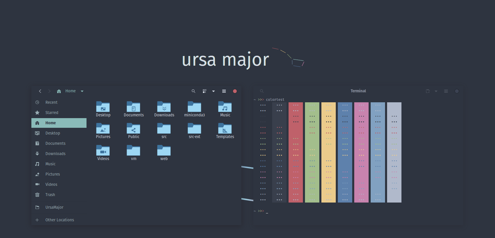

Ursa Major is a colorscheme, inspired by Nord, but designed to offer more 
balanced gray/white hues.

# Installation

Clone the repository with the following command

```bash
git clone https://github.com/kgoettler/ursamajor.git
```

## GNOME

Copy the contents of the `gnome` directory to `~/.themes` or `/usr/share/themes`:

```bash
mkdir ~/.themes/UrsaMajor
cp -r ./gnome/* ~/.themes/UrsaMajor
```

Activate the theme using the Appearance GUI, or with the following commands:

```bash
gsettings set org.gnome.desktop.interface gtk-theme "UrsaMajor"
gsettings set org.gnome.desktop.wm.preferences theme "UrsaMajor"
```
